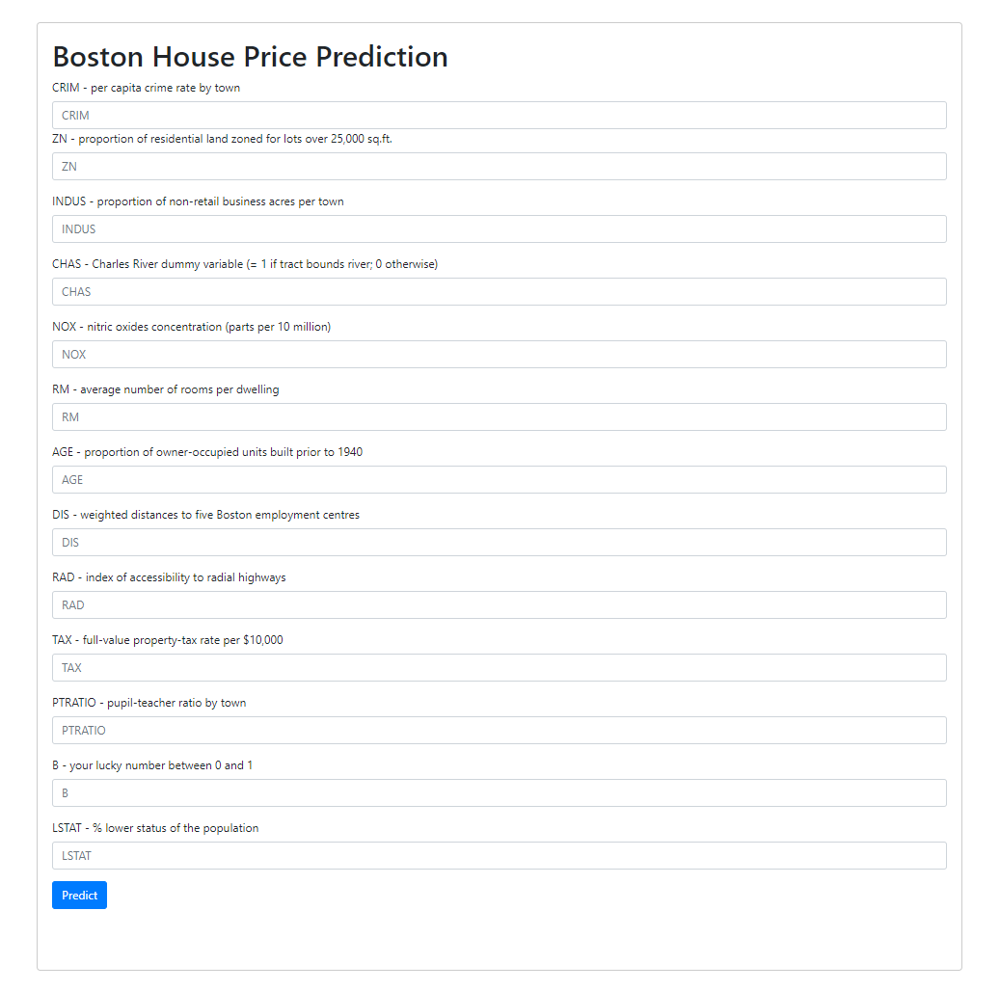

# Boston House Pricing Prediction
This program predicts the prices of the houses in the Boston area based on certain features. It uses a Linear Regression model to make these predictions.
This project also features a frontend and backend for a web application written in flask which uses a pickled model.




## Libraries Used
- numpy
- pandas
- matplotlib
- seaborn
- scikit-learn
- flask
- pickle

## Usage
1. Create a python virtual environment
```
python -m venv <venv_name>
```

2. Activate the environment (different for each platform)
```
bash/zsh
$ source <venv>/bin/activate

fish
$ source <venv>/bin/activate.fish

csh/tcsh
$ source <venv>/bin/activate.csh

PowerShell
$ <venv>/bin/Activate.ps1

cmd.exe
C:\> <venv>\Scripts\activate.bat

PowerShell
PS C:\> <venv>\Scripts\Activate.ps1
```

3. Install the libraries in requirements.txt file using:

```
pip install -r requirements
```

## Dataset
The Boston House Pricing dataset is used for this program. This dataset is included in the scikit-learn library.
The dataset is not included in the most recent version of scikit-learn because of ethical reasoning.

## Program Overview
The program performs the following steps:

1. Loads the Boston House Pricing dataset.
2. Prepares the dataset and performs basic analysis.
3. Performs exploratory data analysis on the dataset.
4. Prepares the dataset for the model.
5. Trains the Linear Regression model.
6. Makes predictions using the test data and calculates the mean squared error.

## Credits
This project was made following the explanation of the following youtube tutorial:
https://www.youtube.com/watch?v=MJ1vWb1rGwM